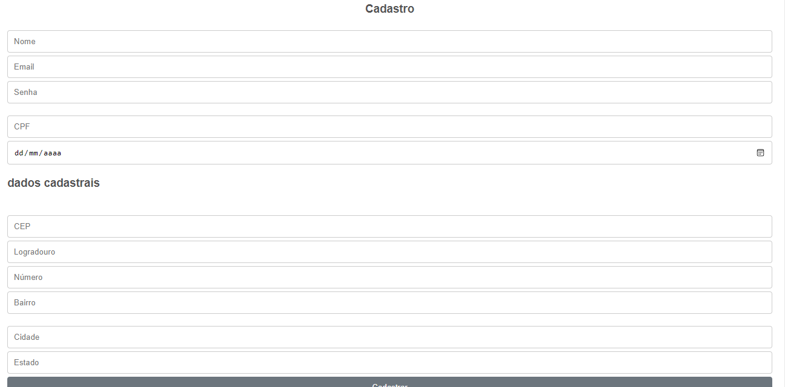
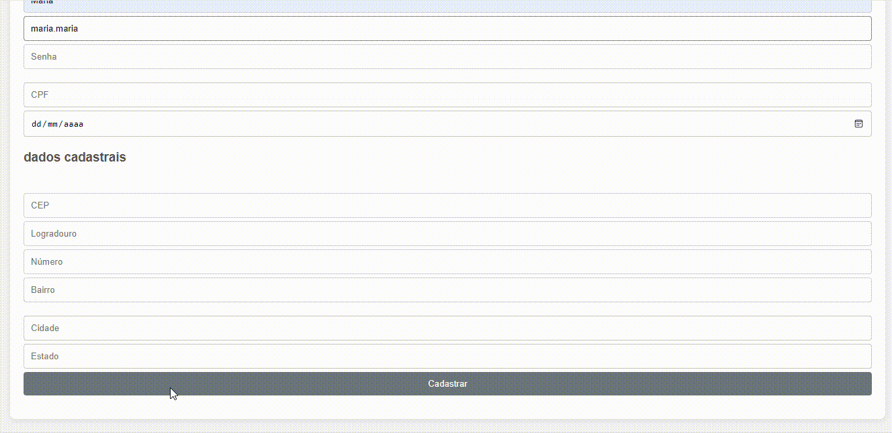

# Sistema de Cadastro

Este projeto consiste em um formulário de cadastro simples, onde os usuários podem inserir suas informações pessoais e de contato.

## Estrutura do Projeto

O projeto contém os seguintes arquivos:

- `index.html`: O arquivo HTML principal que contém o formulário de cadastro.
- `style.css`: O arquivo CSS que estiliza o formulário e a página.
- `cadastro.js`: O arquivo JavaScript que implementa a lógica de cadastro e validações.

## Tecnologias Utilizadas

- HTML5
- CSS3
- JavaScript

## Descrição do Formulário

O formulário de cadastro inclui os seguintes campos:

1. **Dados Pessoais**
   - Nome
   - Email
   - Senha
   - CPF
   - Data de Nascimento

2. **Dados Cadastrais**
   - CEP
   - Logradouro
   - Número
   - Bairro
   - Cidade
   - Estado

## Funcionalidades

### Validação do Formulário

- **Validação do CPF**: Verifica se o CPF inserido é válido.
- **Validação do E-mail**: Verifica se o formato do e-mail é válido.
- **Validação de CEP**: Verifica se o CEP de endereço é válido.

### Busca de Endereço

- Quando o usuário insere um CEP, o sistema busca automaticamente o logradouro, bairro, cidade e estado correspondentes utilizando a API ViaCEP.

## Autores 

### Autora 
[Maria Yanagui](https://github.com/MariaYanagui)

## Colaborador 

[Guilherme Serafim](https://github.com/Guilimas2)

